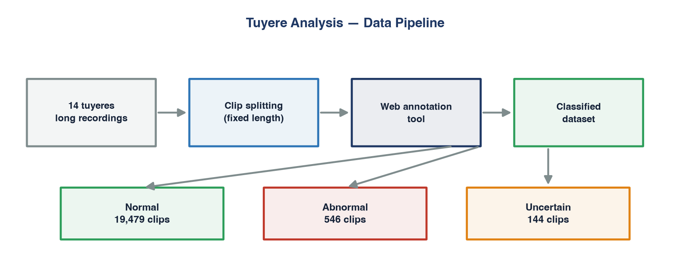
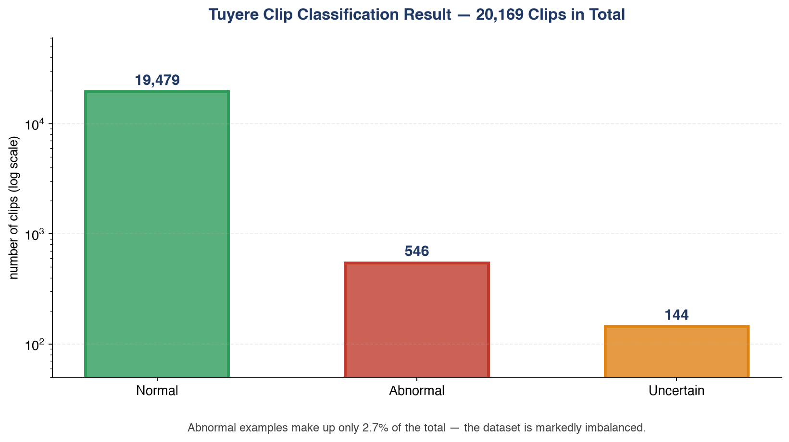

🇹🇷 **Türkçe** · [🇬🇧 English](README.md)

# Tüyer Anomali Etiketleme Araçları

Yüksek fırın tüyerlerine ait saatlerce süren kamera kayıtlarını **20.169 kısa
klipten** oluşan etiketli bir veri setine dönüştüren araç seti. Anomali tespiti
eğitimine hazır.

Entegre bir demir-çelik tesisinin proses otomasyonu biriminde, yaz stajı
kapsamında geliştirildi.

> **Veri hakkında.** Fırın görüntüleri gizlidir, bu depoda **yer almaz**.
> Yayımlanan şey araçlardır.

---

## Problem

Tüyer, yüksek fırına sıcak hava ve kömür tozu üfleyen uçtur. Önünde cüruf
asılması, tıkanma ya da kömür beslemesinin kesilmesi üretimi doğrudan etkiler.
Her tüyerin önünde bir kamera var — ama on dördünü birden sürekli izleyecek
kimse yok.

Anormal durumları işaretleyen bir model eğitmek için önce etiketli veri gerekir;
elimizdeki ham malzeme ise saatlerce süren kesintisiz kayıtlardı.

## Veri hattı



### 1 · `split_videos.py` — klip bölme

Uzun kayıtları FFmpeg ile sabit süreli kliplere böler.

- dosya adından tüyer numarasını çıkarıp klipleri ilgili klasöre yazar
- yeniden kodlama yerine **akış kopyalama** kullanır, süreyi ciddi biçimde kısaltır
- sistemde donanım kodlayıcı varsa, yeniden kodlama gereken yerde onu kullanır
- ilerleme çubuğu, tahmini klip sayısı, biçimlendirilmiş süreler

### 2 · `app.py` — web etiketleme aracı

Yirmi bin klibi elle oynatıcıda açmak gerçekçi değildi; sınıflandırma adımı
küçük bir Flask uygulamasına dönüştü:

- sıradaki klibi otomatik oynatır, altında üç düğme: **Normal / Anormal / Belirsiz**
- tıklamayla klip ilgili klasöre taşınır, sonraki klip anında yüklenir
- klavye kısayolları (← normal, → anormal, ↓ belirsiz) — fareye gerek yok
- ilerleme çubuğu ve anlık sayaçlar

### 3 · `extract_frames.py` — kare çıkarma

Sınıflandırılmış kliplerden, seçilen oranda kare çıkarır.

## Sonuç



Not düşülmesi gereken iki bulgu:

- Anormal klipler on dört tüyer arasında **eşit dağılmıyor** — birkaçında
  yoğunlaşıyor. Bunun bakım kayıtlarıyla karşılaştırılması anlamlı olur.
- Set ciddi biçimde dengesiz (~%2,7 anormal). Üzerinde eğitilecek her model
  sınıf ağırlıklandırmasına, ya da düz sınıflandırma yerine anomali tespiti
  yaklaşımına ihtiyaç duyacak.

## Anomali sınıfları

Sorumlu mühendisle birlikte belirlendi: cüruf asılması, raceway çökmesi, tüyer
tıkanması, kömür besleme kesintisi, kömür borusu kırılması, lans hizasızlığı,
büyük kok düşmesi, alev zayıflaması, hava kesilmesi, burn-through.

## Çalıştırma

```bash
python -m venv venv && venv/bin/pip install -r requirements.txt

python split_videos.py --src raw/ --segment 5      # uzun kayıtlar → klipler
python app.py                                       # etiketleme arayüzü → :5050
python extract_frames.py --src Normal/ --dst frames/
```

Klipler `Videolar/` klasöründen okunur; `Normal/`, `Anormal/` veya `Belirsiz/`
klasörlerine taşınır. Kod yorumları Türkçe, belgelendirme iki dilde.
